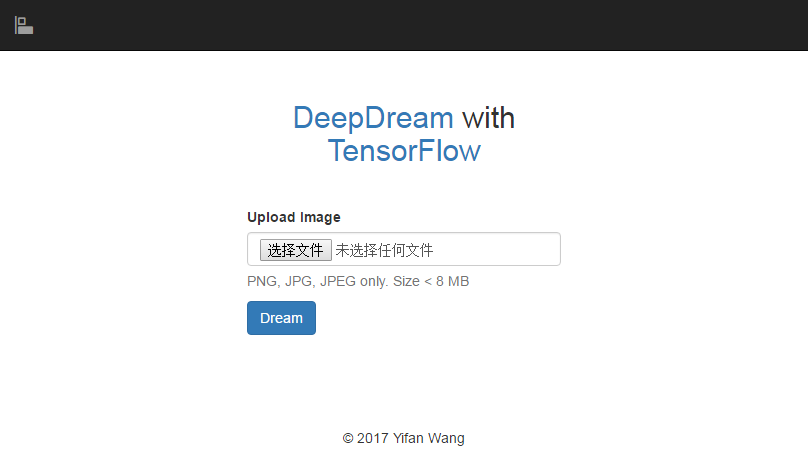

# DeepDream with TensorFlow

This project is a web interface for Google DeepDream, implementing with TensorFlow and Flask.
It helps you easily deploy the fantastic service on your server.

Here is a [**demo**](http://dream.mobsafe.cc/). (Tsinghua University network users only)

## Overview

[DeepDream](https://github.com/google/deepdream) is a Convolutional Neural Network (CNN) image generation technique.
Through it, we can visualize individual feature channels and their combinations to explore the space of patterns learned by the neural network.
Here we also apply Laplacian Pyramid Gradient Normalization to produce smooth and colorful visuals at low cost.
For more details, please read [Google Research Blog](https://research.googleblog.com/2015/06/inceptionism-going-deeper-into-neural.html) and [TensorFlow tutorial](https://github.com/tensorflow/tensorflow/tree/master/tensorflow/examples/tutorials/deepdream).

## Requirements

* Python 2.7 or 3.5
* TensorFlow (>= r0.7)
* NumPy
* PIL
* Flask (also with Flask-Bootstrap)

Before running the code, put the neural network model in [`models/`](models/) folder.
(Check [this document](models/README.md) for help.)

## Usage

**Make sure the model file is ready first!**

You can simply use [`dream.py`](dream.py) to generate DeepDream-like images in the command line.

``` bash
python dream.py -l layer_name -i image_file -o output_file
```

Feel free to play with other optional arguments:

``` bash
python dream.py -h
```

```
Number of layers: 59
Total number of feature channels: 7548
usage: dream.py [-h] [-l LAYER] [-i IMAGE] [-o OUTPUT] [--lap LAP_N]
                [--iter ITER_N] [--step STEP] [--octave OCTAVE_N]
                [--scale OCTAVE_SCALE]

optional arguments:
  -h, --help            show this help message and exit
  -l LAYER, --layer LAYER
                        layer name
  -i IMAGE, --image IMAGE
                        source image
  -o OUTPUT, --output OUTPUT
                        output file
  --lap LAP_N           lap_n (0 for not using Laplacian pyramid)
  --iter ITER_N         iter_n
  --step STEP           step
  --octave OCTAVE_N     octave_n
  --scale OCTAVE_SCALE  octave_scale
```

If you use the default (Google's) model, all of the layer names are listed [here](http://storage.googleapis.com/deepdream/visualz/tensorflow_inception/index.html).

[`example.py`](example.py) will show you how to use those functions in a Python environment.

Running the following command will create a web service on your server.

``` bash
python webapp.py
```



## License

[MIT License](LICENSE)
